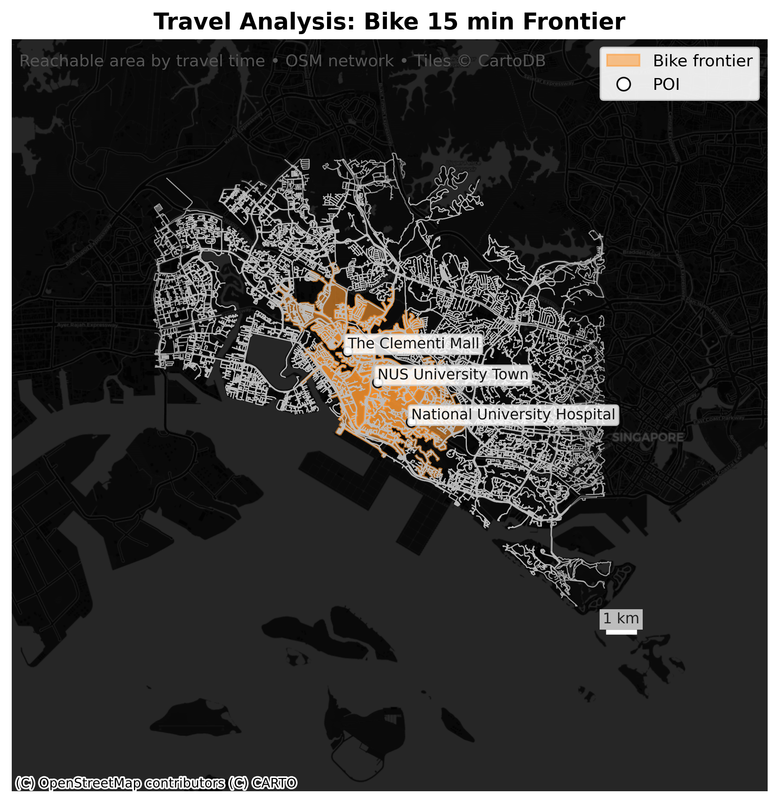

# 🗺️ TravelTimeApp

**TravelTimeApp** is an interactive Python-based tool that visualizes *multi-mode travel-time accessibility maps* for user-defined Points of Interest (POIs).  
It supports travel modes such as **walk**, **bike**, and **drive**, and automatically generates reachability maps based on travel time, departure time, and mode selection.


The app integrates a powerful **geospatial analysis pipeline** (using `OSMnx`, `GeoPandas`, and `Contextily`) with an intuitive **Tkinter-based user interface**, allowing anyone to run complex spatial computations without writing code.

---

## 📰News
- `2025.10.31` Some optimizations have been made, including unify the crs (EPSG:3414), add the basemap, improve the color scheme. 
- `2025.10.30` First prototype TTA tool version lauched.


## 🚀 Features

- 🧭 **Multi-mode travel analysis**: Supports `walk`, `bike`, `drive`, and their combinations.
- 🏙️ **User-defined POIs**: Input three POIs (locations or landmarks) separated by commas.
- ⏱️ **Travel time control**: Choose a departure time (in minutes) to define reachability.
- 🗺️ **Automatic map generation**: Generates and saves high-resolution accessibility maps.
- 💡 **Progress bar feedback**: Displays live progress during data processing.
- 🖼️ **Interactive gallery viewer**: View all generated maps inside the app (Prev / Next / Auto-play).
- 📂 **One-click output access**: “Open Maps Folder” button opens the results directly.
- 💻 **Standalone executable**: Distributed as a single `.exe` for Windows users — no installation required.

---

## 🧩 System Requirements

- **Operating System:** Windows 10/11 (tested), macOS and Linux supported via source.
- **Python version:** 3.9 – 3.11  
- **Required packages:**
  ```bash
  osmnx
  geopandas
  contextily
  shapely
  fiona
  pyproj
  rtree
  matplotlib
  pillow
  tkinter (built-in)
  scikit-learn

**If you plan to run the app from source, it’s best to use a Conda environment.**

## 🛠️ Installation (From Source)
1. Clone the repository:
   ```
   git clone git@github.com:yanjie99/TravelTimeAnalysisTool.git
   cd TravelTimeApp
   ```
2. Create a clean environment and install dependencies:
   ```
   conda create -n traveltime python=3.11 -y
   conda activate traveltime
   pip install -r requirements.txt
   ```
3. Run the app:
   ```
   python UI_TraTA_app4.py
   ```
4. The main interface will open --Enter:
- Three POIs (e.g., `NUS University Town`, `Singapore Botanic Gardens`, `HortPark`)
- Select one or multiple travel models
- Specify travel time (minutes)
- Click `Run`
The app will display progress, generate maps, and show them inside a built-in viewer.

## 🧮 Running as an Executable (Windows)
If you download the standalone [TravelTimeApp.exe](https://drive.google.com/file/d/1sv6KpXRxgJfHwldzDYFUsb9VhSkK2J20/view?usp=sharing):
1. Double-click `TravelTimeApp.exe` to launch the interface.
2. Enter your inputs and run,
3. Click "Open Maps Folder" to view generated travel-time maps.
All results are automatically saved in the `maps/` folder located next to the executable.

## 🏗️ Build Your Own Executable
If you'd like to rebuild the `.exe` from the source:
1. Install `pyinstaller`:
   ```
   pip install pyinstaller
   ```
2. Build using the included spec file:
   ```
   pyinstaller travel_time_app_2.spec (travel_time_app.spec is an older version of this tool, please ignore)
3. The compiled executable will appear in:
   ```
   dist/TravelTimeApp.exe
   ```
**Note for GIS Packaging**
- The `Travel_time_app_2.spec` automatically bundles OSMnx, Contextily, Rasterio, Fiona, Pyproj, and related C libraries.
- The runtime hook `hook_set_gis_env.py` ensures `PROJ_LIB` and `GDAL_DATA` are correctly configured.

## 📁 Project Structure
```
TravelTimeApp(Executable, Windows)/
│
├── build      # internal software procedures
├── dist       # .exe starter

TravelTimeApp(Source)/
│
├── UI_TraTA_app4.py           # Tkinter UI frontend
├── TravelTimeAnalysis.py       # Core spatial analysis pipeline
├── TravelTimeAnalysis2.py      # Wrapper adding progress callbacks
├── travel_time_app.spec        # PyInstaller build script
├── hook_set_gis_env.py         # Runtime hook for GDAL/PROJ paths
├── maps/                       # Output directory for generated maps
├── README.md                   # Project documentation
└── requirements.txt            # Python dependencies (for developers)
```

## 🧭 Example Workflow
1. Enter POIs:
```
NUS University Town, Singapore Botanic Gardens, HortPark
```
2. Choose travel model(s):
✅ Walk ✅ Bike ✅ Drive
3. Set travel time:
Default: `15` minutes
4. Click **Run**
→ See the progress bar
→ The generated maps will appear in the UI gallery
→ Open the maps/ folder to access the saved PNGs.
→ Also can generate geojson/gpkg file for travel mode analysis adjusting the source code. 

## 🧑‍💻 Acknowledgements
- [OSMnx](https://github.com/gboeing/osmnx) -- Street network & travel graph analysis
- [GeoPandas](https://geopandas.org/) -- Spatial data handing
- [Contextily](https://contextily.readthedocs.io/) -- Basemap tiles for visualizations
- [NetworkX](https://networkx.org/) -- Shortest path computation
- [PyInstaller](https://pyinstaller.org/) -- Application packaging


## 📜 License
This project is released under the MIT License.
You’re free to use, modify, and distribute it with attribution.

